# Jev × Binance: рабочий план автономного торгового бота

> Документ-спецификация. Не инвестиционная рекомендация.  
> Модель: TypeSafe AI **Jev** (System One, text-only, early access, сентябрь 2026).  
> Биржа: Binance Spot / USD-M Futures. Старт только с Testnet / paper.

---

## 0. Коротко

Jev **не смотрит на график глазами** и **не пишет текст**.  
На вход — сжатое состояние рынка (свечи, индикаторы, стакан, позиция, новости).  
На выход — типизированные решения с вероятностями за ~70–500 мс:

| Примитив | Что возвращает | Пример в боте |
|---|---|---|
| `Choice` | один вариант из закрытого списка + вероятности | `buy_long / sell_short / close / hold` |
| `Noul` | P(да) ∈ [0, 1] | «ложный пробой?», «торговать сейчас?» |
| `Score` | положение на заданной шкале | сила сигнала: нет края → сильный |

**Правило архитектуры:** код считает признаки, размер, стоп и лимиты.  
Jev только **судит сигнал**. Сайзинг и риск модели не отдавать.

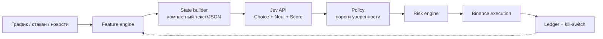

---

## 1. Зачем Jev, а не LLM

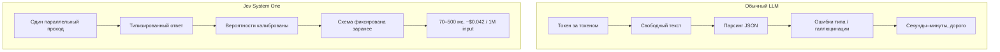

| Параметр | Jev 1.13 | Frontier LLM |
|---|---|---|
| Выход | Choice / Score / Noul | свободный текст |
| Latency | 70–500 мс | секунды–минуты |
| Цена входа | $0.042 / 1M tok | существенно выше |
| Выходные токены | не тарифицируются | тарифицируются |
| Картинки графика | нет (text-only) | зависит от модели |
| Гарантия схемы | да | нет, нужен парсер |

Пинить версию в проде: `jev-1.13.0`, не `jev-latest` — иначе поедут пороги.

---

## 2. Целевая архитектура бота

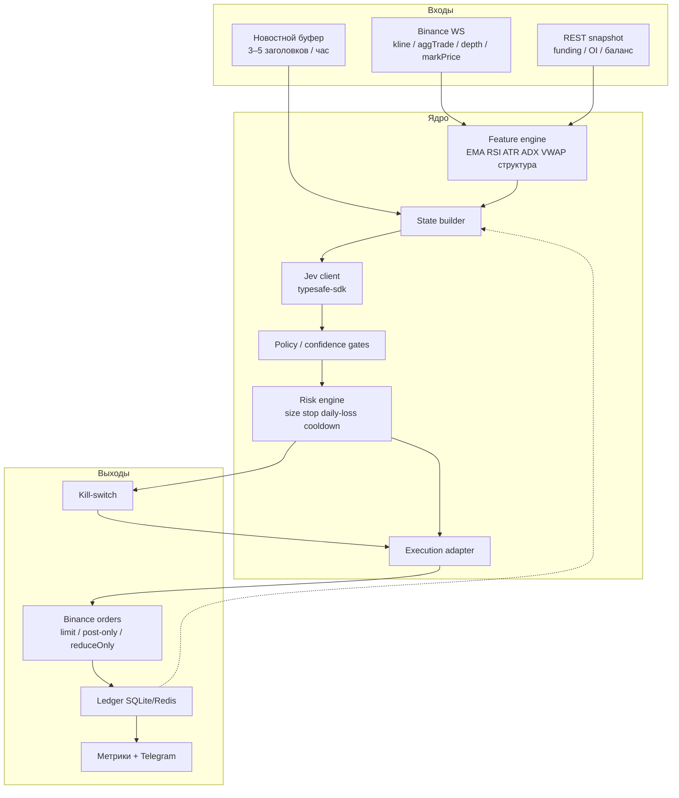

### Цикл принятия решения

Не каждый тик. На CEX разумный ритм — **закрытие свечи** или **событие** (пробой свинга, всплеск объёма, скачок funding).

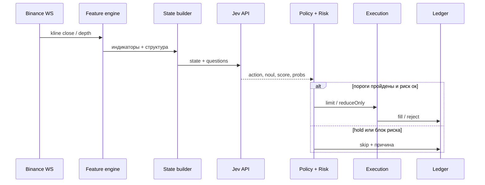

---

## 3. Как «анализ графика» без зрения

Jev не ест PNG TradingView. График сериализуется в короткий state.

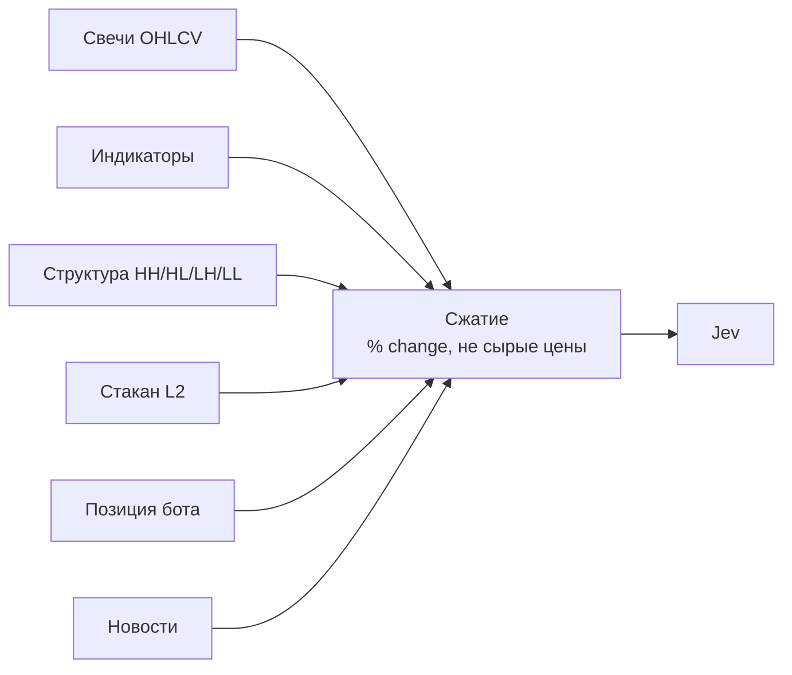

### Минимальный снапшот (BTCUSDT 5m)

```text
symbol=BTCUSDT tf=5m ts=2026-09-18T14:35Z
close=108420 ret_1=0.12% ret_5=0.41% atr14=0.38%
ema20>ema50>ema200 adx=27 rsi=61 vwap_dist=+0.22%
structure=HH_HL last_swing_low=-0.9%
book_imb=+0.18 spread=1.2bps
pos=FLAT cash_usdt=10000
news: "ETF inflow +$240m; no FOMC today"
```

| Блок state | Содержание | Зачем |
|---|---|---|
| Цена | close, ret_1 / ret_5 / ret_12 | импульс без сырого тика |
| Вола | ATR%, диапазон бара / ATR | стоп считает код, Jev видит режим |
| Тренд | EMA20/50/200, ADX | фильтр направления |
| Осциллятор | RSI, dist-to-VWAP | перегрев / возврат |
| Структура | HH/HL или LH/LL, дистанция до свинга | контекст пробоя |
| Стакан | imbalance top-5, spread bps | микроструктура входа |
| Позиция | side, size, entry, uPnL%, время в сделке | close ≠ новый вход |
| Макро-микро | funding, ΔOI 1h, корреляция с BTC | режим фьючерсов |
| Текст | 3–5 заголовков | Jev сильна на тексте |

Лимит: порядка 32k токенов на state + вопросы. Не класть 500 сырых свечей.

---

## 4. Схема вопросов к Jev (ядро v1)

Один вызов `system_one` — несколько вопросов параллельно.

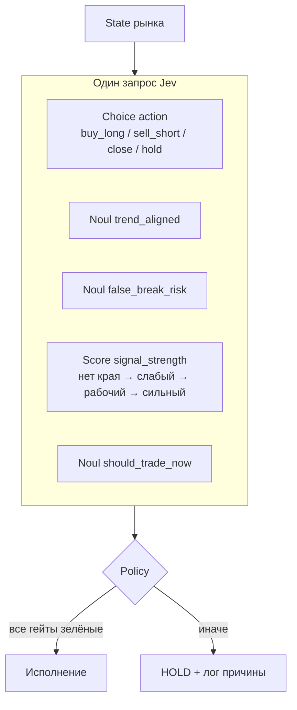

### Формулировки

**1. Choice `action`**  
Инструкция: выбрать действие на горизонте 6–12 баров рабочего ТФ с учётом тренда старшего ТФ, импульса, структуры и стакана.  
Критерии:

- `buy_long` — преимущество у роста, вход в лонг оправдан;
- `sell_short` — преимущество у снижения, вход в шорт оправдан;
- `close` — открытую позицию лучше закрыть;
- `hold` — края нет, ждать.

**2. Noul `trend_aligned`**  
«Движение согласовано с режимом вышестоящего ТФ?»

**3. Noul `false_break_risk`**  
«Высокий риск ложного пробоя текущего уровня / свинга?»

**4. Score `signal_strength`**  
Шкала: `нет края` / `слабый` / `рабочий` / `сильный`.

**5. Noul `should_trade_now`**  
«Сейчас стоит открывать, а не ждать следующий бар?»

Не просить у Jev: целевую цену, размер позиции, «почему рынок упадёт».

---

## 5. Policy: пороги (код, не модель)

Стартовые значения — **гипотеза**. Калибровать на сохранённых ответах Jev, не угадывать.

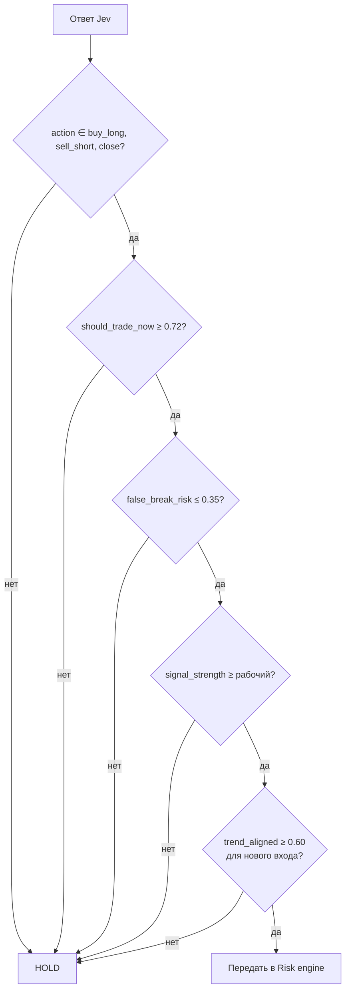

| Гейт | Старт | Смысл |
|---|---|---|
| `should_trade_now` | ≥ 0.72 | отсечь «почти» |
| `false_break_risk` | ≤ 0.35 | не ловить шипы |
| `signal_strength` | ≥ «рабочий» | не торговать шум |
| `trend_aligned` | ≥ 0.60 на вход | не контртренд v1 |
| `close` | можно ослабить `trend_aligned` | выход важнее входа |

Все отказы писать в лог: `skip_reason=false_break|low_strength|…`.

---

## 6. Risk engine и исполнение Binance

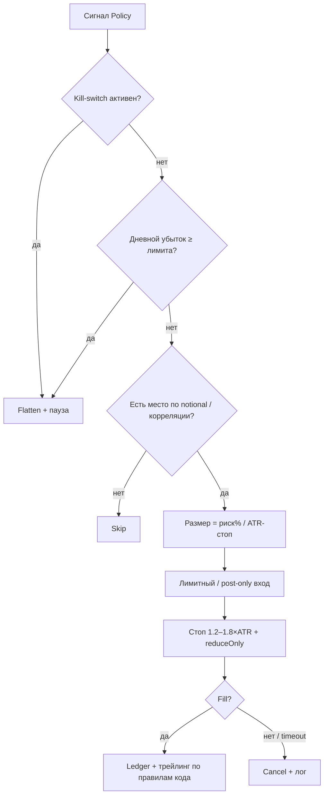

### Жёсткие лимиты (Jev не имеет права ломать)

| Правило | Старт v1 |
|---|---|
| Риск на сделку | 0.3–0.7% депозита |
| Стоп | 1.2–1.8 × ATR рабочего ТФ |
| Плечо | 2–5× isolated |
| Одновременно позиций | 1–3 |
| Корреляция | лимит совместного BTC-beta |
| Дневной стоп счёта | −2…−3% → flatten до завтра |
| Вход | limit / post-only |
| Выход по аварии | market + reduceOnly |
| Cooldown после стопа | N баров |
| API-ключ | trade only, **без withdraw** |
| События | блок входа при высоком news_shock |

### Исполнение

- Futures: `POST /fapi/v1/order`, `reduceOnly` на закрытии.
- User Data Stream — fill / partial / cancel.
- Идемпотентность: стабильный `clientOrderId`.
- В симе сразу закладывать комиссию 0.02–0.04% и проскальзывание.
- Сверять локальный ledger с позицией биржи на каждом цикле.

---

## 7. Стек

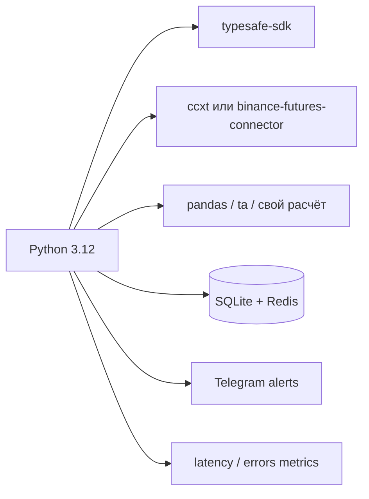

| Слой | Выбор |
|---|---|
| Язык | Python 3.12 |
| Jev | `pip install typesafe-sdk`, env `TYPESAFE_API_KEY` |
| Биржа | Binance Testnet → live sub-account |
| Данные | WS kline + depth, REST для funding/баланса |
| Хранение | SQLite сделки, Redis горячий state |
| Деплой | маленький VPS ближе к региону API Binance |
| Секреты | только env, ключ без withdraw |

Ориентиры по чужому коду (не копировать в live blindly):

- `jarrodwatts/jev-trader` — частый цикл, Choice buy/sell;
- `tyleree/jevbot` — Jev как ядро, риск в коде;
- `Spykoninho/trading-bot-jev` — Binance + Jev по новостям;
- `zadescoxp/Jev-Trades` — paper + индикаторы.

---

## 8. Этапы внедрения

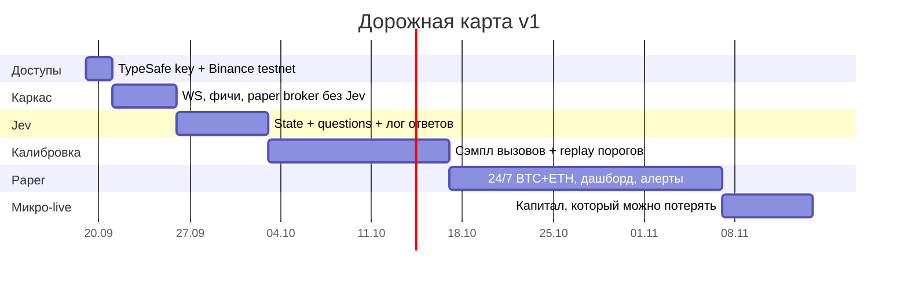

### Этап 0 — доступы (1–2 дня)

- Ключ TypeSafe, `TYPESAFE_API_KEY`.
- Binance Testnet + отдельный sub-account.
- Репозиторий, секреты вне git.

### Этап 1 — каркас без Jev (3–5 дней)

- Стрим kline + depth.
- Индикаторы + state builder.
- Бумажный брокер и ledger.
- Dummy-policy RSI/EMA, чтобы ордерный пайплайн жил.

### Этап 2 — Jev как судья (3–7 дней)

```python
from typesafe_sdk import Choice, Noul, Score, TypeSafeClient

client = TypeSafeClient(model="jev-1.13.0")

response = client.system_one(
    state=market_state_text,
    questions={
        "action": Choice(
            instructions="Действие на горизонте 6–12 баров рабочего ТФ.",
            criteria={
                "buy_long": "Преимущество у роста, вход в лонг.",
                "sell_short": "Преимущество у снижения, вход в шорт.",
                "close": "Открытую позицию лучше закрыть.",
                "hold": "Края нет, ждать.",
            },
        ),
        "trend_aligned": Noul(
            instructions="Движение согласовано с режимом старшего ТФ."
        ),
        "false_break_risk": Noul(
            instructions="Высокий риск ложного пробоя."
        ),
        "signal_strength": Score(
            instructions="Сила края.",
            criteria=["нет края", "слабый", "рабочий", "сильный"],
        ),
        "should_trade_now": Noul(
            instructions="Стоит открывать сейчас, а не ждать следующий бар."
        ),
    },
)
```

Логировать request, response, mid-цену через 6 и 12 баров.

### Этап 3 — бэктест / walk-forward (1–2 недели)

Jev платная, бесплатного historical replay нет.

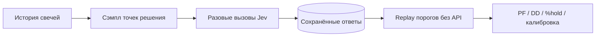

1. Базовая история без Jev.
2. На сэмпле точек — вызвать Jev, сохранить ответы.
3. Крутить пороги на сохранённых ответах.
4. Hold-out отрезок не трогать при подборе порогов.

Метрики: profit factor, max DD, доля `hold`, калибровка вероятностей, cost per decision.

Ожидание по ранним публичным прогонам: Jev часто много `hold`, край без фильтров слабый. Не закладывать «+50% в месяц».

### Этап 4 — paper 24/7 (2–4 недели)

- Пары: BTCUSDT, ETHUSDT.
- Дашборд: action, probs, позиция, PnL, latency, ошибки.
- Telegram: дневной стоп, рассинхрон позиции, p95 latency > 800 мс.

### Этап 5 — микро-live

- Сумма, которую можно потерять целиком.
- Те же пороги, что на бумаге.
- Неделя наблюдения → только потом масштаб.

---

## 9. Стоимость и частота вызовов

| Величина | Ориентир |
|---|---|
| Цена входа | $0.042 / 1M токенов |
| Выход | $0 |
| Latency | 70–500 мс |
| Rate limit (публично) | порядка 1200 req/min |
| Размер снапшота | ~400–1500 токенов |
| Ритм v1 | 2 пары × 5m ≈ 576 вызовов/сутки |

Узкое место — качество вопросов и калибровка, не счёт TypeSafe.  
Не вызывать Jev на каждый тик стакана.

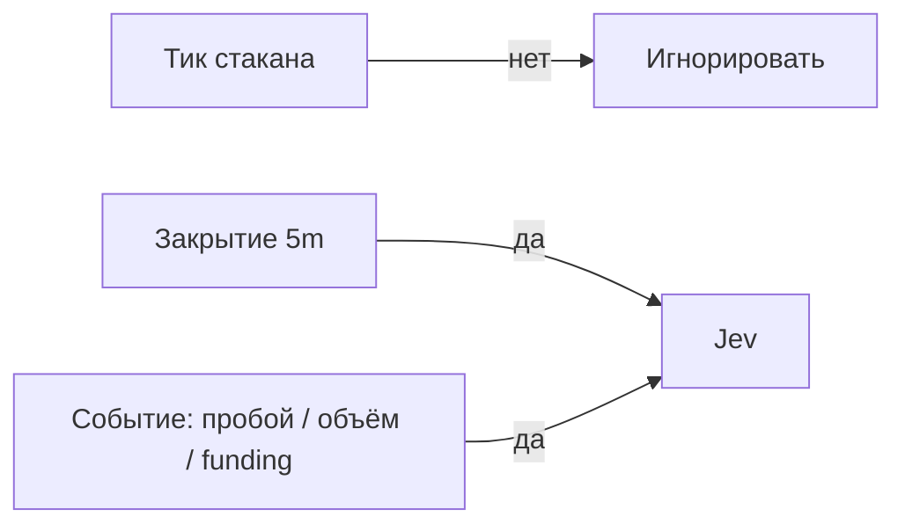

---

## 10. Усиления после v1

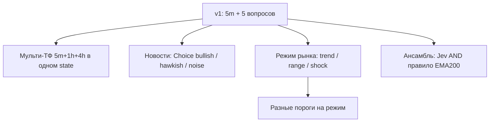

- Мульти-ТФ: один state, не три дорогих вызова.
- Новости судит Jev, торговать/нет решает код.
- Режим рынка отдельным `Choice` → разные гейты.
- Не плодить модели: один Jev, разные схемы вопросов.

---

## 11. Чего не делать

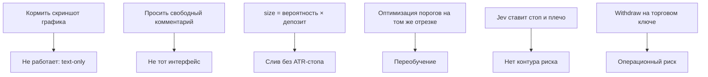

- Не публиковать бенчмарки Jev, если это запрещает customer agreement.
- Не считать сам факт «новой модели» альфой.  
  Альфа = state + вопросы + риск + исполнение.

---

## 12. Карта ответственности

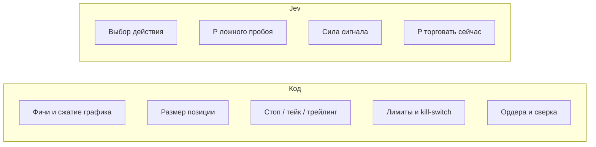

Если контур слева слабый, скорость Jev не спасёт.

---

## 13. Чеклист запуска paper

- [ ] `TYPESAFE_API_KEY` и модель `jev-1.13.0`
- [ ] Binance Testnet, ключ без withdraw
- [ ] State builder даёт стабильный сжатый текст
- [ ] Пять вопросов v1 логируются целиком
- [ ] Policy гейты в коде, не «как скажет модель»
- [ ] ATR-стоп и дневной лимит убытка
- [ ] Ledger сверяется с биржей
- [ ] Алерты latency / flatten / рассинхрон
- [ ] Есть hold-out для порогов
- [ ] Понимание: большинство таких ботов на live не повторяют бумагу

---

## 14. Словарь

| Термин | Значение здесь |
|---|---|
| System One | модель быстрых типизированных решений, не чат |
| Choice / Noul / Score | три примитива ответа Jev |
| State | сжатое описание рынка + позиции |
| Policy | пороги на вероятностях |
| Risk engine | размер, стоп, лимиты, kill-switch |
| Replay | пересчёт правил на сохранённых ответах без новых вызовов API |
| Post-only | лимитный вход maker, без снятия спреда |

---

*Версия документа: 2026-09-19. Источник: план внедрения Jev на Binance (testnet-first).*
